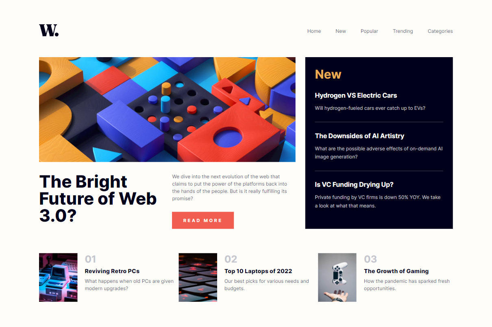

# News Homepage

*Caption: Desktop view of the News Homepage*

*Caption: Mobile view of the News Homepage*

I created an **News Homepage** as part of the [Frontend Mentor](https://www.frontendmentor.io/challenges/news-homepage-H6SWTa1MFl) challenge. A simple modern layout for a news homepage with a responsive design for every screen

## Link

You can see a live demo of the **Sign-up Form** [here](https://lawrpunk.github.io/news-homepage/).

## Features

- Responsive design for any screen size.
- Hamburger menu for mobile devices

## Technologies Used

- HTML
- CSS
- JavaScript

## Acknowledgments

- [Frontend Mentor](https://www.frontendmentor.io/) for the challenge
